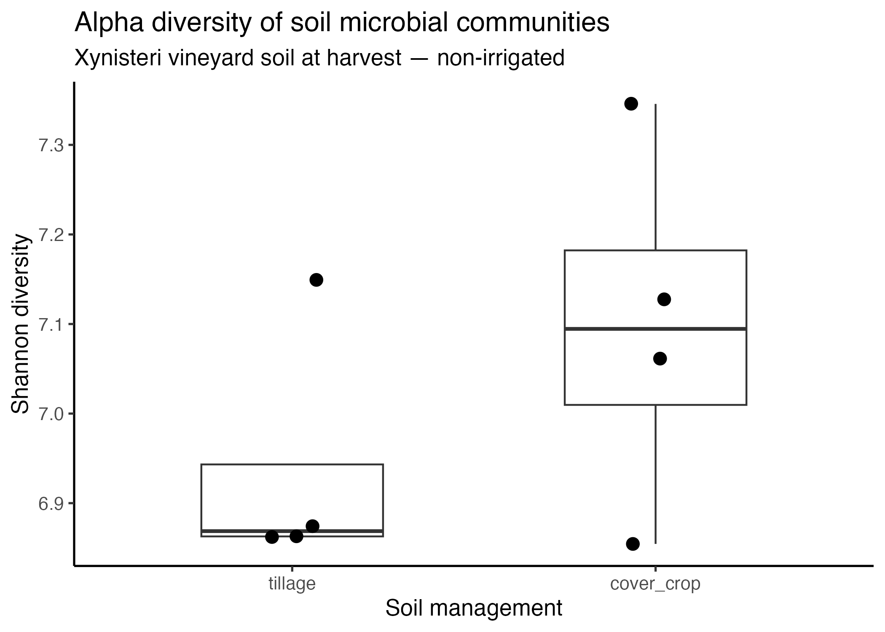
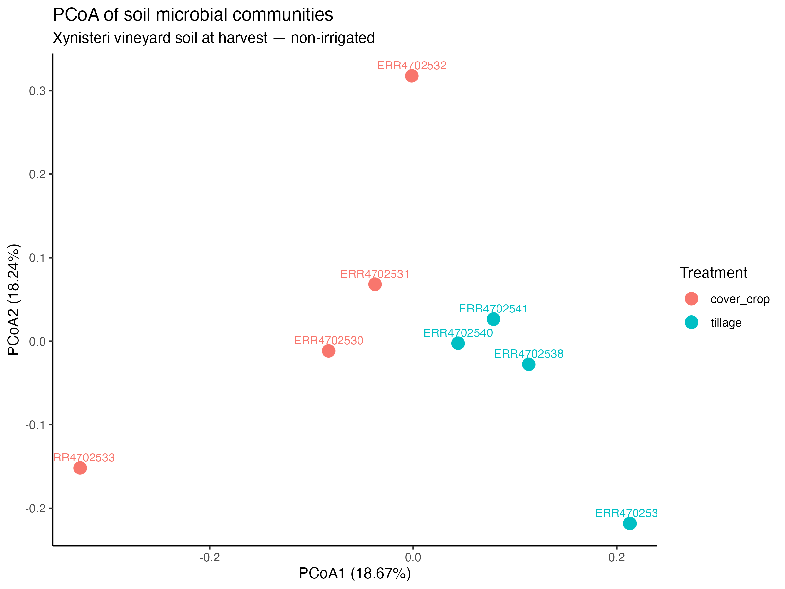
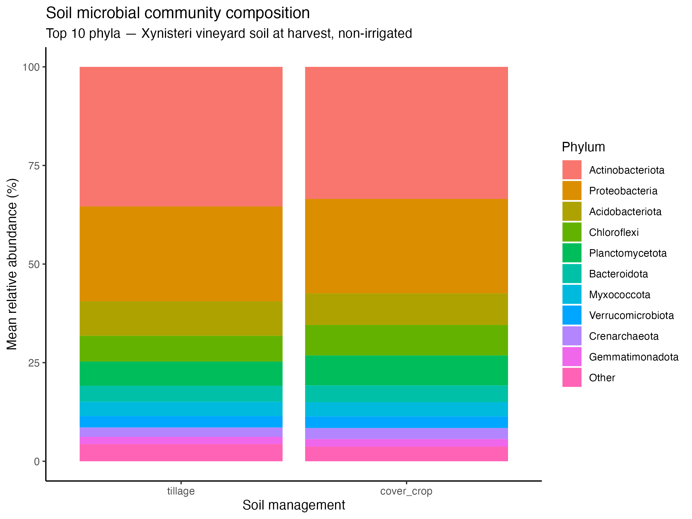
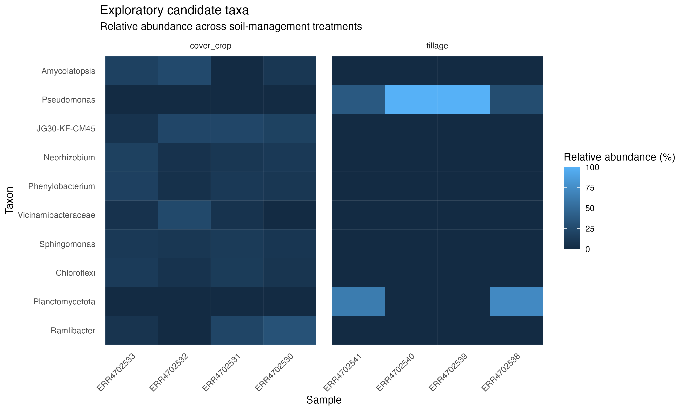

#Vineyard Soil Microbiome Analysis — 16S rRNA & Nextflow

## 16S rRNA amplicon analysis of vineyard soil microbial communities

### Project objective

This project investigates whether **soil management (tillage vs cover crop/no-tillage)** is associated with differences in microbial community composition in vineyard soil.

To isolate the effect of soil management, the analysis focuses on:

* **Cultivar:** Xynisteri
* **Stage:** harvest
* **Irrigation:** no irrigation
* **Treatments:** tillage vs cover crop/no-tillage
* **Samples:** 8 biological samples (4 per treatment)

The sequencing data are from **NCBI BioProject PRJEB40549**.

The project was implemented as a reproducible **Nextflow DSL2 workflow**, but the main focus is the biological analysis and the reasoning behind the analytical decisions.

---

# Biological question

> **Does soil management affect microbial community composition in non-irrigated Xynisteri vineyard soil at harvest?**

The analysis was deliberately restricted to samples sharing the same cultivar, developmental stage and irrigation condition. This reduces variation from other experimental factors and makes the comparison between the two soil-management treatments more focused.

---

# Samples

| Sample     | Treatment  | Irrigation    | Cultivar  | Stage   |
| ---------- | ---------- | ------------- | --------- | ------- |
| ERR4702541 | tillage    | no_irrigation | Xynisteri | harvest |
| ERR4702540 | tillage    | no_irrigation | Xynisteri | harvest |
| ERR4702539 | tillage    | no_irrigation | Xynisteri | harvest |
| ERR4702538 | tillage    | no_irrigation | Xynisteri | harvest |
| ERR4702533 | cover_crop | no_irrigation | Xynisteri | harvest |
| ERR4702532 | cover_crop | no_irrigation | Xynisteri | harvest |
| ERR4702531 | cover_crop | no_irrigation | Xynisteri | harvest |
| ERR4702530 | cover_crop | no_irrigation | Xynisteri | harvest |

Metadata:

```text
assets/samplesheet.csv
```

---

# Analysis workflow

The complete analysis follows this sequence:

```text
Raw paired-end FASTQ
        │
        ├── FastQC
        │
        └── Cutadapt
              │
              ▼
        Trimmed FASTQ
              │
              ├── FastQC
              │
              └── DADA2 filtering
                      │
                      ▼
                Filtered reads
                      │
             ┌────────┴─────────┐
             │                  │
             ▼                  ▼
       Error learning       Denoising
             │                  │
             └───────┬──────────┘
                     ▼
               Read merging
                     │
                     ▼
                 ASV table
                     │
        ┌────────────┼─────────────┐
        │            │             │
        ▼            ▼             ▼
      ASV QC    Alpha diversity  Taxonomy
        │            │             │
        │            │        Phylum abundance
        │            │             │
        │            │        Composition plot
        │
        └────── Rarefaction
                    │
                    ▼
             Rarefied ASV table
                    │
                    ▼
              Bray–Curtis
                    │
             ┌──────┼──────┐
             ▼      ▼      ▼
            PCoA  PERMANOVA PERMDISP

FastQC raw + FastQC trimmed
              │
              ▼
            MultiQC
```

---
## Step 1 — Raw read quality control

**Input:** Raw paired-end FASTQ files from `data/raw/`

**Tools:** FastQC + MultiQC

FastQC was used to assess the quality of the raw sequencing reads. MultiQC was then used to aggregate the FastQC results into an interactive report.

**Output:**

* FastQC reports: `results/qc/raw/fastqc/`
* MultiQC report: `results/qc/multiqc_raw/multiqc_raw_report.html`

### Result

Quality control was performed for all 8 samples before adapter trimming.

**[View interactive raw-read MultiQC report](https://larisa19.github.io/microbial_ecology/qc/raw/multiqc_raw_report.html)**

---

## Step 2 — Adapter trimming

**Input:** Raw paired-end FASTQ files from `data/raw/`

**Tool:** Cutadapt

Illumina/TruSeq adapter sequences were removed from the forward and reverse reads using Cutadapt.

**Output:** Trimmed paired-end FASTQ files in `results/cutadapt/`

---

## Step 3 — Trimmed read quality control

**Input:** Trimmed paired-end FASTQ files from `results/cutadapt/`

**Tools:** FastQC + MultiQC

FastQC was used to assess read quality after adapter removal. MultiQC was then used to aggregate the results into a separate interactive report.

**Output:**

* FastQC reports: `results/qc/trimmed/fastqc/`
* MultiQC report: `results/qc/multiqc_trimmed/multiqc_trimmed_report.html`

### Result

Quality control was performed for all 8 samples after adapter trimming.

**[View interactive trimmed-read MultiQC report](https://larisa19.github.io/microbial_ecology/qc/trimmed/multiqc_trimmed_report.html)**

## Step 4 — DADA2 quality filtering

**Input:** Trimmed paired-end FASTQ files

The trimmed reads were filtered to remove low-quality reads and reads containing ambiguous bases.

**Tool:** DADA2 `filterAndTrim()`

Parameters:

* `truncLen = c(220, 180)`
* `maxN = 0`
* `maxEE = c(2, 2)`
* `truncQ = 2`
* `rm.phix = TRUE`
* `compress = TRUE`

**Output:** Filtered forward and reverse FASTQ files and filtering statistics.

Files: `results/dada2/filter/`

---

## Step 5 — Learn the DADA2 error model

**Input:**

* Filtered forward reads from all samples
* Filtered reverse reads from all samples

The DADA2 error model was learned from the filtered reads to characterize sequencing errors.

**Tool:** DADA2 `learnErrors()`

Forward and reverse reads were modeled separately.

**Output:** `error_model_F.rds` and `error_model_R.rds`

Files: `results/dada2/errors/error_model_F.rds`, `results/dada2/errors/error_model_R.rds`

---

## Step 6 — Denoise reads

**Input:**

* Filtered forward and reverse reads
* Forward and reverse DADA2 error models

The filtered reads were denoised to distinguish biological sequence variation from sequencing errors.

**Tool:** DADA2 `dada()`

Forward and reverse reads were denoised separately using the corresponding error models.

**Output:** DADA2 denoising objects and dereplicated read objects for each sample.

Files: `results/dada2/denoise/`

---

## Step 7 — Paired-end merging

**Input:**

* Denoised forward reads
* Denoised reverse reads
* Corresponding dereplicated reads

The forward and reverse DADA2 results were merged to reconstruct the amplicon sequences.

**Tool:** DADA2 `mergePairs()`

**Output:** One merged object per sample.

Files: `results/dada2/merge/`

---

## Step 8 — Construct the ASV table

**Input:** Merged sequences from all samples

The merged sequences were combined into a sequence-by-sample abundance matrix.

**Tool:** DADA2

The workflow:

* reads all merged objects
* extracts unique ASV sequences
* creates a matrix with ASVs as rows and samples as columns
* fills the matrix with the corresponding sequence abundances

**Output:** `results/dada2/table/asv_table.rds`, `results/dada2/table/asv_table.tsv`

### Result

The final table contains:

* **8,953 ASVs**
* **625,399 total reads**

File: `results/dada2/table/asv_table.tsv`

The ASV table is the main input for the downstream ecological analyses.

---

## Step 9 — ASV quality control

**Input:**

* ASV table
* sample metadata

The ASV table was validated against the sample metadata before downstream ecological analyses.

**Tool:** Python

The workflow:

* reads the ASV table
* identifies all sample IDs
* counts total ASVs and reads per sample
* counts observed ASVs per sample
* reads the sample metadata
* compares sample IDs between the ASV table and metadata
* checks for invalid rows or missing samples

**Output:** 
`asv_qc_summary.tsv` — sample-level summary of sequencing reads and observed ASVs; `asv_qc_validation.txt` — validation report confirming that the ASV table and metadata are correctly aligned.

### Result

The validation confirmed:

* **8 samples** in the metadata
* **8 samples** in the ASV table
* **8 matching samples**
* **8,953 ASVs**
* **0 invalid rows**
* No samples missing from either the ASV table or metadata

Files: `results/asv_qc/asv_qc_summary.tsv`, `results/asv_qc/asv_qc_validation.txt`

The validated ASV table can now be used for downstream ecological analyses.

---
## Step 10 — Alpha diversity

Alpha diversity was calculated to describe microbial diversity within each sample.
**Input:**

* ASV table
* sample metadata

**Tool:** R

Two measures were calculated:

* **Observed ASVs** — number of detected ASVs per sample
* **Shannon diversity** — accounts for both richness and relative abundance

**Output:** `results/alpha_diversity/alpha_diversity.tsv`

### Result

Alpha-diversity values were calculated for all **8 samples**.

The results were used to compare within-sample diversity between the two soil-management treatments.

**Figure:** [](results/figures/alpha_diversity_shannon.png)

## Step 11 — Rarefaction

**Input:** ASV abundance table from `results/dada2/`

**Tool:** R

The ASV table was rarefied to the minimum sequencing depth across samples to standardize sampling effort before beta-diversity analysis. Reads were subsampled without replacement using a fixed random seed (`123`) for reproducibility.

**Output:**

* Rarefied ASV table: `results/rarefaction/asv_table_rarefied.tsv`
* Rarefaction information: `results/rarefaction/rarefaction_info.txt`

### Result

The rarefied ASV table was used as input for the beta-diversity analysis.

---

## Step 12 — Beta diversity

**Input:**

* Rarefied ASV table: `results/rarefaction/asv_table_rarefied.tsv`
* Sample metadata: `samplesheet.csv`

**Tools:** R + vegan + ggplot2

Bray-Curtis dissimilarity was calculated to compare microbial community composition between samples. Principal Coordinates Analysis (PCoA) was used to visualize community-level differences.

PERMANOVA with 999 permutations was used to test whether community composition differed between soil-management treatments (`tillage` vs `cover_crop`). PERMDISP was used to assess differences in within-group dispersion.

**Output:**

* Bray-Curtis distance matrix: `results/beta_diversity/bray_curtis_distance.tsv`
* PCoA coordinates: `results/beta_diversity/pcoa_coordinates.tsv`
* PERMANOVA results: `results/beta_diversity/permanova_results.tsv`
* PERMDISP results: `results/beta_diversity/permdisp_results.tsv`
* PCoA plot: `results/beta_diversity/pcoa_treatment.png`
* Analysis summary: `results/beta_diversity/beta_diversity_summary.txt`

### Result

The first two PCoA axes explained **18.71%** and **18.41%** of the variation, respectively.

PERMANOVA indicated a treatment-associated difference in microbial community composition (**R² = 0.17, p = 0.03**).

PERMDISP showed no significant difference in within-group dispersion (**p = 0.552**).

The comparison included 4 samples per treatment and was therefore considered exploratory.

**Figure:** [](results/beta_diversity/pcoa_treatment.png)


## Step 13 — Taxonomic profiling

**Input:**

* ASV abundance table
* SILVA v138.1 reference database
* Sample metadata

**Tools:** DADA2 + R + ggplot2

Taxonomy was assigned to ASV sequences using the SILVA v138.1 reference database. ASV abundances were then aggregated at the phylum level and summarized by soil-management treatment.

The 10 most abundant phyla across samples were visualized, with remaining phyla grouped as "Other".

**Output:**

* Taxonomic assignments: `results/taxonomy/taxonomy.tsv`
* Phylum-level relative abundance: `results/taxonomy/phylum_abundance.tsv`
* Phylum composition plot: `results/figures/phylum_composition.png`

### Result

Taxonomic profiles were generated for the 8 samples and summarized at the phylum level to compare microbial community composition between `tillage` and `cover_crop` treatments.

**Figure:** [](results/figures/phylum_composition.png)


## Step 14 — Differential abundance analysis

**Input:**

* ASV abundance table
* Sample metadata
* Soil-management treatment groups

**Tools:** R

Differential abundance analysis was performed at the ASV level to identify microbial features showing differences in relative abundance between `tillage` and `cover_crop` treatments.

ASVs were first filtered based on prevalence, retaining features detected in at least two samples in either treatment group. Abundance counts were then converted to relative abundance to account for differences in sequencing depth between samples.

For each ASV, mean and median relative abundance were calculated for each treatment. A Wilcoxon rank-sum test was used to compare the two treatment groups, and log2 fold change was calculated as the ratio of mean relative abundance in `cover_crop` relative to `tillage`.

Because only four biological replicates were available per treatment, the analysis was considered exploratory. Multiple testing correction was performed using the Benjamini-Hochberg false discovery rate (FDR) procedure.

ASVs were considered statistically significant when **FDR < 0.05** and **|log2 fold change| ≥ 1**.

**Output:**

* Differential abundance results: `results/differential_abundance/differential_abundance.tsv`
* Differential abundance summary: `results/differential_abundance/differential_abundance_summary.txt`

### Result

A total of 8 samples and 8,965 ASVs were analysed. After prevalence filtering, 2,799 ASVs were retained for differential abundance testing.

No individual ASVs met both the FDR and effect-size thresholds.

This indicates that, although some ASVs showed large differences in relative abundance between treatments, these individual differences were not statistically supported after multiple-testing correction.

At the community level, treatment effects were detected by PERMANOVA in the beta-diversity analysis (R² = 0.17, p = 0.03), while PERMDISP showed no evidence of differences in within-group dispersion (p = 0.552).

Therefore, soil management was associated with differences in overall microbial community composition, but no individual ASVs could be identified as statistically significant differential features in this dataset.

**Figure:** [](results/candidate_taxa/candidate_taxa_heatmap.png)

## Step 15 — Overall conclusions

### Biological question

**Does soil management (tillage vs cover crop/no-tillage) affect the microbial community composition of non-irrigated Xynisteri vineyard soil at harvest?**

### Conclusion

The analysis provides evidence that soil-management treatment was associated with differences in the overall microbial community composition.

Bray-Curtis beta-diversity analysis followed by PCoA showed separation between samples according to soil-management treatment. PERMANOVA indicated that treatment explained approximately **17% of the variation in community composition (R² = 0.17, p = 0.028)**.

PERMDISP was not significant (**p = 0.572**), providing no evidence that differences in within-group dispersion were driving the PERMANOVA result.

At the individual-ASV level, no features remained statistically significant after Benjamini-Hochberg multiple-testing correction. However, **1,115 ASVs showed an exploratory effect size of |log2 fold change| ≥ 2**, and the strongest candidates were linked to their taxonomic assignments for further interpretation.

These results suggest that soil-management treatment was associated with a **community-level shift in microbial composition**, while the available sample size was insufficient to confidently identify individual differential taxa.

Because only four biological replicates were available per treatment, these findings should be considered exploratory and would benefit from validation with a larger number of biological replicates.

### Key findings

| Analysis                              |                   Result |
| ------------------------------------- | -----------------------: |
| Samples                               |                        8 |
| Treatments                            | 4 tillage / 4 cover crop |
| Total ASVs                            |                    8,965 |
| PERMANOVA                             |     R² = 0.17, p = 0.028 |
| PERMDISP                              |                p = 0.572 |
| Significant ASVs after FDR correction |                        0 |
| Exploratory ASVs (|log2FC| ≥ 2)       |                    1,115 |


Overall, the workflow demonstrates a reproducible 16S rRNA amplicon analysis from raw sequencing reads through quality control, ASV inference, diversity analysis, statistical testing, taxonomic profiling and exploratory feature interpretation.

The analysis was implemented as a modular Nextflow DSL2 workflow. Independent analytical steps were organized into reusable modules, with explicit input/output channels connecting quality control, ASV inference, diversity analysis, taxonomy and downstream statistical analyses. This structure makes the workflow reproducible, restartable and easier to extend.

## Reproducibility

The workflow was implemented using Nextflow DSL2.

The analysis can be resumed using Nextflow's `-resume` functionality, allowing completed processes to be reused rather than rerun.

Reference data and large sequencing files are not stored in the repository. The SILVA reference database is downloaded separately and referenced by the workflow.

The workflow uses fixed parameters and seeds where stochastic subsampling is required.

## How to run

Clone the repository and enter the project directory:

```bash
git clone https://github.com/Larisa19/microbial_ecology.git
cd microbial_ecology
```

